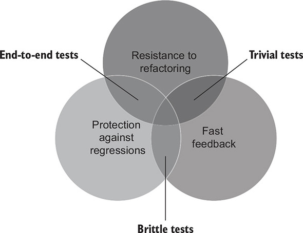
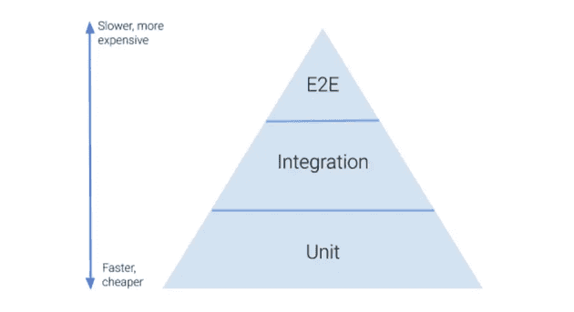

# Chapter4. 좋은 단위 테스트의 4대 요소

# Chapter 4. 좋은 단위 테스트의 4대 요소

- 해당 장을 통해 가치있는 테스트를 **식별**할 수 있다

## 4.1 좋은 단위 테스트의 4대 요소

- 회귀 방지
- 리팩터링 내성
- 빠른 피드백
- 유지 보수성

### 4.1.1 첫 번째 요소: 회귀 방지

- 회귀: 코드를 수정한 후 이전에 제대로 작동하던 소프트웨어 기능에 문제가 생기는 것을 가리킴
- 회귀 방지 지표 평가 요소
    - 테스트 중에 실행되는 코드의 양
    - 코드 복잡도
    - 코드의 도메인 유의성
- 회귀를 방지하기 위해선 테스트가 가능한 한 많은 코드를 실행해야 함

### 4.1.2 두 번째 요소: 리팩터링 내성

- 거짓 양성(false positive): 실제 기능은 정상적으로 동작하지만 테스트에서만 에러가 나는 허위 경보
- 테스트가 지속 가능한 성장이 가능한 이유는 **회귀 없이 주기적으로 리팩터링하고 새로운 기능을 추가할 수 있기 때문**
- 하지만 거짓 양성이 존재하면 테스트에 대한 신뢰가 떨어져 타당한 기능 실패도 문제없다 판단하여 운영에 들어가거나 허위 경보를 피하기 위해 리팩터링 빈도가 줄어듬

### 4.1.3 무엇이 거짓 양성의 원인인가?

- 테스트와 SUT의 구현 세부 사항이 많이 결합할수록 허위 경보가 많이 생김
- 이를 줄이기 위해 구현 세부 사항에서 테스트를 분리하고, 테스트를 통해 SUT가 제공하는 최종 결과를 검증하는지 확인해야함

### 4.1.4 구현 세부 사항 대신 최종 결과를 목표로 하기


## 4.2 회귀 방지와 리팩터링 내성 간의 본질적인 관계

### 4.2.1 테스트 정확도 극대화


- 테스트 정확도 = 신호(발견된 버그 수) / 소음(허위 경보 발생 수)
- 정확도를 높히기 위해 회귀를 더 잘 찾아내는 테스트로 개선하거나, 허위 경보를 발생시키 않는 테스트로 개선

### 4.2.2 거짓 양성과 거짓 음성의 중요성

- 프로젝트 초기에 거짓 양성은 거짓 음성 만큼 프로젝트에 부정적인 영향을 주지 않지만, 시간이 흐를수록 리팩터링 내성도 점점 중요해짐

## 4.3 세 번째 요소와 네 번째 요소: 빠른 피드백과 유지보수성

- 빠른 피드백은 단위 테스트의 필수 속성! 테스트가 빠를수록 더 많은 테스트를 수행할  수 있고 더 자주 실행할 수 있다
- 유지 보수성에서 유지비용은 다음 두 가지 주요 요소로 구성
    - 테스트가 얼마나 이해하기 어려운가: 테스트의 크기와 보통 관련이 있음. 코드 라인이 적을수록 읽기가 쉽다
    - 테스트가 얼마나 실행하기 어려운가: 테스트가 외부 종속성으로 작동할 경우 데이터베이스 서버를 올리고 네트워크 연결을 맺는 등 시간 낭비가 되어 유지비용이 증가

## 4.4 이상적인 테스트를 찾아서

- 앞서 살펴본 회귀방지, 리팩터링내성, 빠른피드백, 유지보수성을 곱하면 테스트의 가치가 결점됨
- 가치 추정치 = [0…1] * [0…1] * [0…1] * [0…1]
- 즉, 하나라도 만족하지 않으면 테스트의 가치는 0이 된다

### 4.4.1 이상적인 테스트를 만들 수 있는가?

- 회귀방지, 리팩터링 내성, 빠른 피드백은 상호 배타적이기에 모든 속성에 1(최대값)을 가지는 테스트를 만드는 것은 불가능

### 4.4.2 극단적인 사례 1: 엔드 투 엔드 테스트

- 엔드 투 엔드 테스트는 많은 코드를 테스트하므로 회귀 방지를 훌륭히 해냄
- 또한 거짓 양성에 면역이 돼 리팩터링 내성에 우수하다
- 그러나 느린 속도로 빠른 피드백을 받기가 어렵다

### 4.4.3 극단적인 사례 2: 간단한 테스트

- getter, setter 등을 테스트하는 간단한 테스트는 리팩터링 내성에 우수하며 굉장히 빠른 피드백을 제공하지만 사실상 어떤 것도 테스트 하지 않는다고 볼수있다.(의미가 없는 테스트)

### 4.4.4 극단적인 사례3: 깨지기 쉬운 테스트

```java
public void GetById_executes_correct_SQL_code(){
	var sut = new UserRepository();

	User user = sut.GetById(5);

	Asser.Equal("SELECT * FROM USER WHERE USER_ID = 5", sut.LastExecutedSqlStatement);
}
```

- 위 같은 테스트는 빠른 실행과 회귀를 잡을 가능성이 높지만 한글자라도 달라지면 바로 오류를 보여주기에 리팩토링 내성이 전혀 없다

### 4.4.5 이상적인 테스트를 찾아서: 결론



- 위의 세가지 속성을 모두 만족할 수 없기에 전략적으로 희생이 필요
- 그 중 리팩터링 내성을 포기하지 않고 빠른 피드백과 회귀 방지 사이에서 절충안을 찾아야함
- 리팩터링 내성을 포기할 수 없는 이유는 테스트가 리팩터링 내성이 있거나 없거나 둘 중 하나이기 때문

## 4.5 대중적인 테스트 자동화 개념 살펴보기

### 4.5.1 테스트 피라미드 분해



- 피라미드 각 층의 너비는 테스트 수를 의미
- 하단은 빠른 피드백을 상단은 회귀 방지에 가중치를 둠
- 앞서 말했듯 리팩터링 내성은 모든 계층에서 중요(거짓 양성을 가능한 적게 하는 것을 목표로 함)

### 4.5.2 블랙박스 테스트와 화이트박스 테스트 간의 선택

- 블랙박스 테스트
    - 시스템의 내부 구조를 몰라도 시스템의 기능을 검사할 수 있는 소프트웨어 테스트 방법
    - 명세와 요구 사항으로 무엇을 해야하는 지를 중심으로 구축
    - 회귀 방지에 나쁘지만 리팩터링 내성에 좋음
- 화이트박스 테스트
    - 블랙박스 테스트에 반대대는 개념이며 애플리케이션의 내부 작업을 검증하는 테스트 방식
    - 회귀 방지에 좋지만 리팩터링 내성에 나쁨
- 리팩터링 내성은 타협할 수 없기에 블랙박스 테스트를 기본으로 선택
- 화이트박스 방식은 테스트를 분석할 때 이용할 수 있음